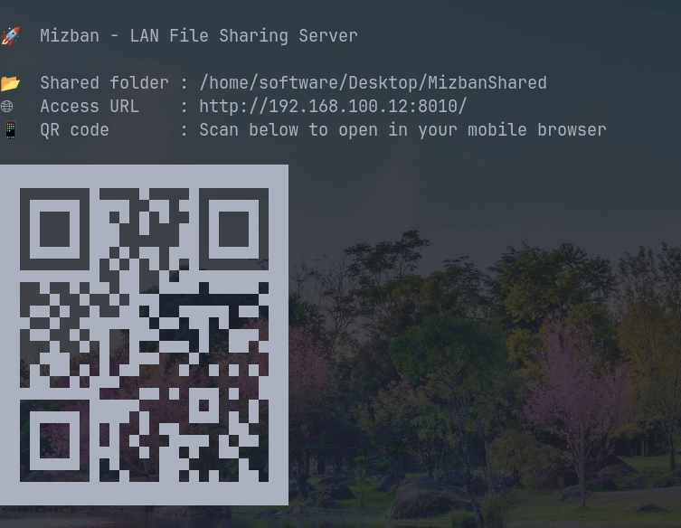
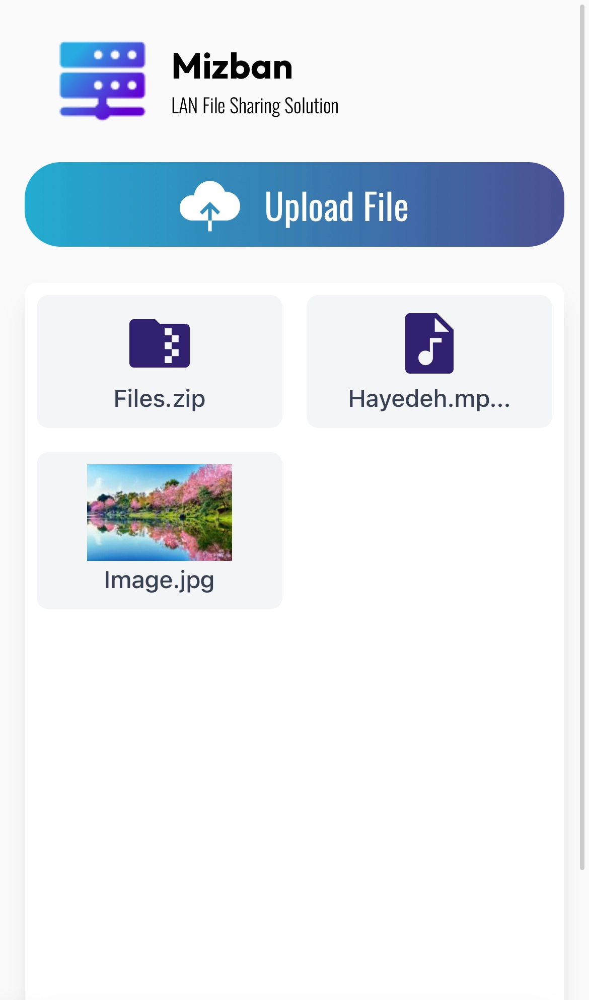

<div align="center">
  
</div>

<p align="center">
  <em>
    Mizban is a lightweight, LAN-based file sharing tool that lets you share files between devices on the same network.
  </em>
</p>

<p align="center">
  <a href="https://github.com/aminupy/mizban/actions/workflows/release.yml"></a>
  <a href="https://github.com/aminupy/mizban/releases"></a>
  <a href="https://github.com/aminupy/mizban/releases"></a>
  <a href="https://github.com/aminupy/mizban/stargazers"></a>
</p>

<p align="center">
  <a href="https://img.shields.io/github/license/aminupy/mizban"></a>
  <a href="https://img.shields.io/github/go-mod/go-version/aminupy/mizban"></a>
  <a href="https://github.com/aminupy/mizban/issues"></a>
  <a href="https://github.com/aminupy/mizban/pulls"></a>
</p>

---

## Features

- **Single binary runtime** on Windows, macOS, and Linux
- **LAN client UI** at `/` for upload/download and file browsing
- **Local admin UI** at `/settings` (localhost-only) for configuration
- **High-throughput transfers** with parallel chunked upload/download
- **QR code startup access** for fast mobile/desktop connection
- **Config compatibility preserved** (`~/.config/Mizban/config.json`)

---

## Screenshots

<div align="center">
  
  
  
</div>

---

## Installation

### Windows

1. Download the latest `msi` from  
   👉 [Latest Releases](https://github.com/aminupy/mizban/releases/latest)
2. Run the installer and follow setup.

> **Note**: On first launch, allow Mizban through Windows Firewall so LAN devices can connect.

---

### macOS

1. Download `dmg` (or `pkg`) from  
   👉 [Latest Releases](https://github.com/aminupy/mizban/releases/latest)
2. Install and run `mizban`.

---

### Linux

#### Option A: install from latest release (recommended)

```bash
curl -fsSL https://raw.githubusercontent.com/aminupy/mizban/main/install.sh | sh
```

#### Option B: install `.deb`

Download and install the correct architecture package from Releases:

```bash
sudo dpkg -i mizban-<version>-linux-<arch>.deb
```

After installation, run:

```bash
mizban
```

> **Note**: Ensure `~/.local/bin` is in `PATH` if you used the install script.

---

## Usage

1. Start Mizban: `mizban`
2. `MizbanShared` is created on Desktop by default.
3. Terminal prints the LAN URL and QR code.
4. Open the LAN URL on any device in the same network.
5. Use `/settings` on the host machine (`127.0.0.1`) to change config.
6. If port changes, click **Restart Now** from settings.

> Mizban runs only on local network. No cloud account, no internet service dependency.

---

## Configuration

Default config file:

```text
~/.config/Mizban/config.json
```

Common fields:

```json
{
  "mizban_shared_dir": "/home/user/Desktop/MizbanShared",
  "port": 8000,
  "parallel_chunks": 8,
  "chunk_size_bytes": 4194304,
  "max_file_size_bytes": 107374182400
}
```

---

## Build

Build all platform binaries (`linux/darwin/windows`, `amd64/arm64`):

```bash
make build
```

Create portable archives + checksums:

```bash
make VERSION=<x.y.z> release
```

Build native installers (on matching OS/toolchain):

```bash
make VERSION=<x.y.z> package
```

---

## CI Release Workflow

GitHub Actions workflow: `.github/workflows/release.yml`

- Push tag `v<x.y.z>`:
  - builds binaries/installers
  - publishes GitHub Release with assets
- Manual run (`workflow_dispatch`):
  - builds everything
  - uploads artifacts
  - **does not publish release**

For full release checklist:

- `docs/RELEASE.md`

---

## Troubleshooting

- `web assets not found`
  - Run from repo root or pass `--web-dir ./web`.
- Port changed but server still on old port
  - Use **Restart Now** in `/settings`.
- Shared folder update fails
  - Enter an absolute path on the host machine.
- Slow transfers
  - Compare with `iperf3` baseline and tune `parallel_chunks` and `chunk_size_bytes`.

---

## Contributing

Contributions are welcome.

- Fork the repository
- Create a feature branch
- Submit a pull request

Bug reports and feature requests:
👉 [https://github.com/aminupy/mizban/issues](https://github.com/aminupy/mizban/issues)

Read contribution and support guides:

- [CONTRIBUTING.md](CONTRIBUTING.md)
- [CODE_OF_CONDUCT.md](CODE_OF_CONDUCT.md)
- [SECURITY.md](SECURITY.md)

---

## Support Mizban

If Mizban helps you, the highest-impact support is:

- Star the repository
- Share it with friends/teams who need LAN file sharing
- Open issues for bugs and feature requests
- Submit pull requests for fixes and improvements

---

## License

Mizban is released under the **MIT License**.
See [LICENSE](LICENSE) for details.
