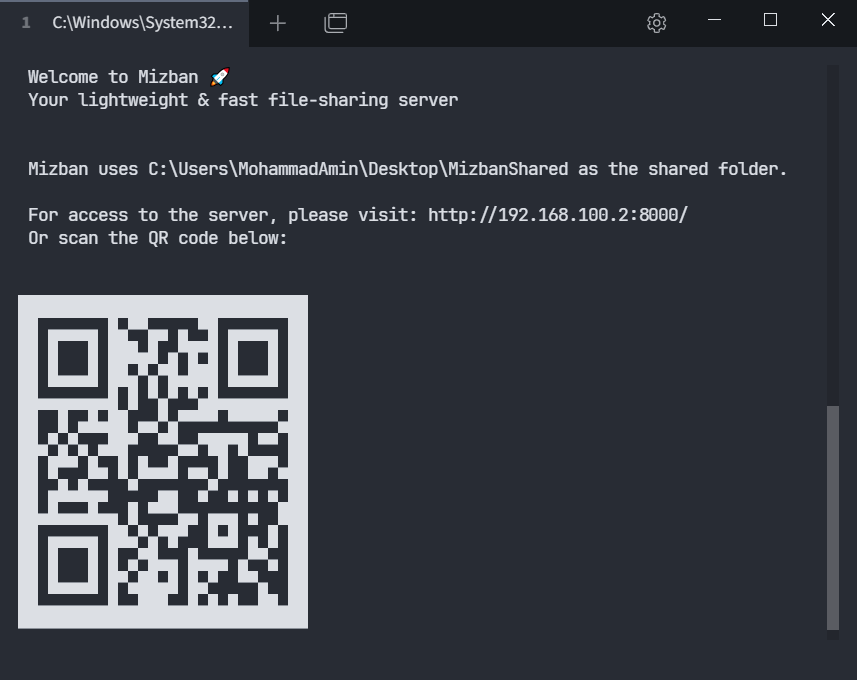
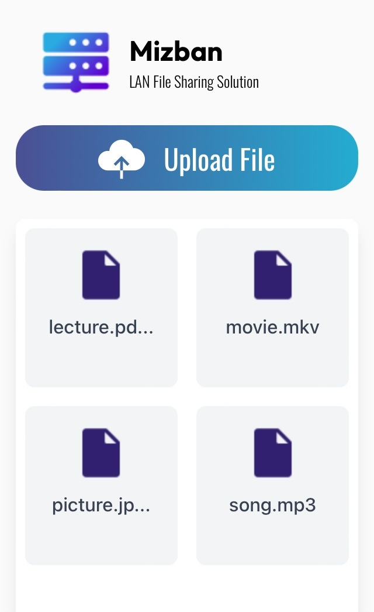
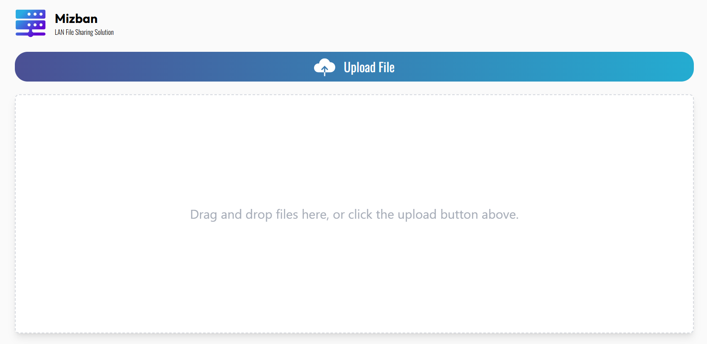

<div align="center">
  
</div>
<br>
<p align="center">
<em>Mizban is a lightweight, LAN-based file-sharing server designed for easy file sharing between devices on the same network.</em>
</p>
<br>


## Table of Contents
1. [Features](#features)
2. [Screenshots](#screenshots)
3. [Installation](#installation)
4. [Usage](#usage)
5. [Roadmap](#roadmap)
6. [Contributing](#contributing)
7. [License](#license)


## Features
- **Easy File Upload and Download**: Share files seamlessly across devices on the same LAN network through a simple browser interface.
- **Multi-Platformt**: Run Mizban as a standalone `.exe` for Windows or an `.AppImage` for Linux.
- **No Configuration Needed**: Just run the executable, and Mizban will automatically create a "MizbanShared" folder on your desktop for storing shared files.
- **Accessing by QR Code**: Quickly access the Mizban web interface by scanning a QR code displayed in the terminal.

---

## Screenshots
<div align="center">
  
  
  
</div>

---

## Installation

### Windows
1. Download and install Mizban using the installer from the [latest release](https://github.com/yourusername/Mizban/releases).
2. Alternatively, you can use the portable `.exe` file, also available on the [latest release page](https://github.com/yourusername/Mizban/releases).
> **Note**: On the first run, make sure to allow Mizban through the Windows Firewall when prompted, so it can access your network for file sharing.


### Linux
1. Download the `.AppImage` file from the [latest release](https://github.com/yourusername/Mizban/releases).
2. Make the file executable:
   ```bash
   chmod +x Mizban.AppImage
   ```
3. Run the `.AppImage` by double-clicking it.
4. After the first run, Mizban will be installed at `~/.local/share/Mizban`, and you can launch it from your application menu for quick access.

## Usage

1. Run the Mizban executable. A folder named `MizbanShared` will be created on your **Desktop**. Any files you place in this folder can be accessed by all devices on the network.
2. A terminal window will open, displaying a QR code.
3. **Scan the QR Code** or enter the URL shown in the terminal on any device on the same network to access the Mizban web interface in your browser.
4. **File Sharing Options**:
   - **Upload**: Drag and drop files into the upload area, or click the "Upload" button to select files.
   - **Download**: Download any shared files directly from the interface with a single click.

> **Note**:Mizban is LAN-based and operates without requiring an internet connection.


## Roadmap
Planned features for future releases:
- **GUI for File Management**: A graphical interface with customizable settings.
- **Password Protection**: Options to restrict access to shared files.
- **Clipboard Sharing**: Share text across LAN-connected devices.


## Contributing
We welcome contributions! If you're interested in the roadmap features or have other ideas:
1. Fork the repository.
2. Create a new branch (`git checkout -b feature/NewFeature`).
3. Commit your changes (`git commit -m 'Add NewFeature'`).
4. Push to the branch (`git push origin feature/NewFeature`).
5. Open a pull request.

You can also report bugs or suggest features via [GitHub issues](https://github.com/yourusername/Mizban/issues).


## License
Mizban is licensed under the MIT License. See the [LICENSE](https://github.com/yourusername/Mizban/blob/main/LICENSE) file for details.
